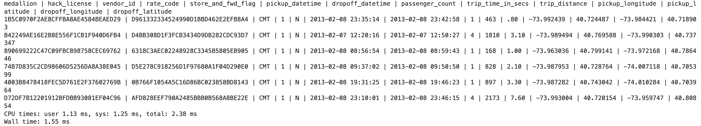

# USA Taxi data analysis - Nisar

 ### Introduction
 In this analysis we will use Taxi dataset which contains the information about the rides in New York City.

The data contains 13,990,177 rows and 14 columns, this is quite large datset which will take around CPU times: user 1min 43s, sys: 1.46 s, total: 1min 44s approx.

### Sample data 
Here is the sample data given below


Each list represents a row in the data

### Reading data file
```python
# First will import few libraries
from datetime import datetime
import csv
import numpy as np
from math import radians, cos, sin, asin, sqrt
import matplotlib.pyplot as plt
```
```python
f = open('trip_data_2.csv', 'r') # using open method to open the file in read mode
reader = csv.reader(f)
c=0                             # c is a counter variable
for row in reader:              # iterate through each list in the reader object
    print(row)
    c+=1
print(c)
```
**Note:** assume I have followed the same file reading code with counter variable in all of the below answer snippets
## Let's start with the coding by answering few questions on the data
### <font color="navy">1. What datetime range does your data cover? How many rows are there total?</font>
The question is about the datetime range does the data covers. We have two different datetime column (pickup_datetime, dropoff_datetime). Let's find the datetime range for both columns

_code_
```python
min_date = None
max_date = None
c = 0
pickup_l, dropoff_l = [], []

for row in reader:
    if c > 0:
        dts_pickup, dts_dropoff = row[5], row[6]
        dto_pickup, dto_dropoff = None, None
        try:
            dto_pickup = datetime.strptime(dts_pickup, '%Y-%m-%d %H:%M:%S')
            dto_dropoff = datetime.strptime(dts_dropoff, '%Y-%m-%d %H:%M:%S')
        except Exception as e:
            print(e)
        if not dto_pickup is None:
            pickup_l.append(dto_pickup)
        
        if not dto_dropoff is None:
            dropoff_l.append(dto_dropoff)
        
    c+=1

pickup_dt_range = max(pickup_l) - min(pickup_l)
dropoff_dt_range = max(dropoff_l) - min(dropoff_l)

print('\n1. What datetime range does your data cover?  How many rows are there total?')
print(f'\nPickup datetime range: {{pickup_dt_range}} \nDropoff datetime range: {{dropoff_dt_range}} \nTotal number of rows: {{c-1}}')
print('\n')
```
_output_

_Explaination_

The above code defines 3 variables min_date, max_date and c (counter variable). 2 lists pickup_l to store pickup_datetime values and droff_l to store the dropoff_datetime values 

Steps:

1. Iterate through each row using for loop
2. will skip the first row using if condition ```if c > 0```
3. Access the pickup_datetime and dropoff_datetime values from the row and store it in dts_pickup, dts_dropoff variables respectively. (i.e, row[5] and row[6]) these 2 values are of type string. So it is necessary to convert it to 'datetime' object
4. Parse the datetime string to convert it into datetime object using datetime library 
5. if the dto is not None then will append the value to the pickup_l and will do the same for dropoff
6. Lastly, subtract the minimum datetime value in maximum datetime value in each list to get the date ranges

### <font color="navy">2. What are the field names? Give descriptions for each field.</font>

_code_
```python
for row in reader:
    print("Field Names:",*row,sep='\n')
    break
```
_output_

_Description_
Columns            | Description 
-------------------|------------------------
medallion          | A medallion is a permit that allows a driver to operate a taxi in United States
hack_license       | A license needed to ride the yellow medalian taxicab
vendor_id          | A code indicating the provider associated with the trip record
rate_code          | Rating provide for the trip
store_and_fwd_flag | This flag indicates whether the trip record was held in vehicle memory before sending to the vendor because the vehicle did not have a connection to the server - Y=store and forward; N=not a store and forward trip
pickup_datetime    | Date and time when the trip was started
dropoff_datetime   | Date and time when the trip was ended
passenger_count    | Total number of passangers boarded in the taxi
trip_time_in_secs  | Total time take to complete the trip in seconds
trip_distance      | Total distance covered to complete the trip
pickup_longitude   | The longitude of the pickup point
pickup_latitude    | The latitude of the pickup point
dropoff_longitude  | The longitude of the dropoff point
dropoff_latitude   | The longitude of the dropoff point


### <font color="navy">3. Give some sample data for each field.</font>
_code_
```python
sample_data = {}

for row in reader:
    if c == 0:
        for col_name in row:
            sample_data[col_name] = []
    elif c>0 and c<11:
        for data, col_name in zip(row, sample_data):
            sample_data[col_name].append(data)
    c+=1

print('''Give some sample data for each field.''')
for i in sample_data:
    print(f'{{i}}: {{sample_data[i]}},\n')
```
_output_

_Explaination_

In the above code, I have defined an empty dictionary sample_data. and stored the first row which contains column names as keys with empty list in values in the dictionary. Since the length of row and dictionary are same I'll zip both together to get correspnding key-value pair. Finally, I'll append the value to the list in the corresponding key (i.e, column name)

_or_ 

we can also use pipeline '|' delimiter to print the data as below
```python
for row in reader:
    print(*row, sep=' | ')
    if c>5:
        break
    c+=1
```
_output_


_Explaination_

I have used unpacking operator ```*``` to unpack row od type list with the pipeline delimiter ```|```. I am just prinitng the first five rows of the data

### <font color="navy">4. What MySQL data types / len would you need to store each of the fields? int(xx), varchar(xx),date,datetime,bool, decimal(m,d)</font>

* medallion : VARCHAR(500)
* hack_license : VARCHAR(500)
* vendor_id : VARCHAR(500)
* rate_code : INT
* store_and_fwd_flag : VARCHAR(10)
* pickup_datetime : DATETIME
* dropoff_datetime : DATETIME
* passenger_count : INT
* trip_time_in_secs : INT
* trip_distance : decimal(6,2)
* pickup_longitude : decimal(10,6)
* pickup_latitude : decimal(10,6)
* dropoff_longitude : decimal(10,6)
* dropoff_latitude : decimal(10,6)

### <font color="navy">5. What is the geographic range of your data (min/max - X/Y)? a. Plot this (approximately on a map)</font>
To answer this question we need to identify 4 points in the geographical region
* eastmost_longitude
* westmost_longitude
* northmost_latitude 
* southmost_latitude

Longitude is a measurement of location east or west of the prime meridian. Latitude is a measurement on a globe or map of location north or south of the Equator

To identify these 4 points we will follow some steps 

1. We will initialize each points with ```Inf``` value. east and north direction will go towards negative values, so, we have initialized with -inf float value
```python
# Initialize variables for extreme points
eastmost_longitude = -float('inf')
westmost_longitude = float('inf')
northmost_latitude = -float('inf')
southmost_latitude = float('inf')
```
2. Will use the Haversine distance to caluclate the trip distance using pickup_longitude, pickup_latitude and dropoff_longitude, dropoff_latitude
```python
def haversine(lon1, lat1, lon2, lat2):
    R = 3959.87433 # this is in miles.  For Earth radius in kilometers use 6372.8 km
    
    dLat = radians(lat2 - lat1)
    dLon = radians(lon2 - lon1)
    lat1 = radians(lat1)
    lat2 = radians(lat2)
    
    a = sin(dLat/2)**2 + cos(lat1)*cos(lat2)*sin(dLon/2)**2
    c = 2*asin(sqrt(a))
    d = R*c
    return d
```
3. Iterate through each row by skipping first row
```python
c = 0 
for row in reader:
    if c == 0:  
       c += 1
       continue
        
    pickup_longitude = float(row[10])
    pickup_latitude = float(row[11])
    # dropoff_longitude = float(row[12])  # Handle missing values if necessary (e.g., using a try-except block)
    try:
        dropoff_longitude = float(row[12])
    except ValueError:
        continue  

    dropoff_latitude = float(row[13])
        
    if c > 0 and row[10] not in ['', '-', None] and row[11] not in ['', '-', None] and row[12] not in ['', '-', None] and row[13] not in ['', '-', None]:
        lon1, lat1, lon2, lat2 = float(row[10]), float(row[11]), float(row[12]), float(row[13])
        trip_dist_h = haversine(lon1, lat1, lon2, lat2)
        trip_dist = float(row[9])
    
    if abs(trip_dist - trip_dist_h) < 2:
        if (pickup_latitude >= 24.521208 and pickup_latitude <= 49.382808) and \
        (dropoff_latitude >= 24.521208 and dropoff_latitude <= 49.382808) and \
        (pickup_longitude >= -124.736342 and pickup_longitude <= -66.945392) and \
        (dropoff_longitude >= -124.736342 and dropoff_longitude <= -66.945392):
            # Update extreme points
            eastmost_longitude = max(eastmost_longitude, pickup_longitude, dropoff_longitude)
            westmost_longitude = min(westmost_longitude, pickup_longitude, dropoff_longitude)
            northmost_latitude = max(northmost_latitude, pickup_latitude, dropoff_latitude)
            southmost_latitude = min(southmost_latitude, pickup_latitude, dropoff_latitude)

    c += 1
```
3. Convert the points to ```float``` and assign each respective values in the _pickup_longitude, pickup_latitude, dropoff_longitude, dropoff_latitude_ variables. There were some unexpected values in the _dropoff_longitude_ so handled it **try execption** block
4. If any of these 4 points are not valid and not contain values like ```['', '-', None]``` then calculate the haversine distance by calling ```haversine(lon1, lat1, lon2, lat2)``` and assign the actual_trip_distance value ```trip_dist = float(row[9])```
5. In the next if condition we will check absolute distance between the _actual_trip_distance_ and _haversine_distance_ . 
6. Do not consider the data whose difference between the Haversine distance actual trip distance value is greater than 1 mile. (This is one way of filtering the data)
7. We know that longitude and latitude of a bounding box around the continental United States are

    - Northernmost: 49.382808 (latitude maximum)
    - Southernmost: 24.521208 (latitude minimum)
    - Easternmost: -66.945392 (longitude maximum)
    - Westernmost: -124.736342 (longitude minimum)

    so we will consider the longitude and latitude cordinates which comes under US range. 
8. We will initialize with the max and min values of all 4 cordinates in the if condition
9. Finally, we will create four sided shape coordinates
```python
# Create the four-sided shape coordinates
shape_coordinates = [(eastmost_longitude, northmost_latitude),
                    (eastmost_longitude, southmost_latitude),
                    (westmost_longitude, southmost_latitude),
                    (westmost_longitude, northmost_latitude)]

print(shape_coordinates)
```
_output_


Using the above coordinates lets plot the range data in https://geojson.io/


### <font color="navy">6. What is the average overall computed trip distance? (You should use Haversine Distance)</font>
Will use the haversine function defined in the above code to calculate the distance

_code_
```python
c = 0
distances = []
distances2 = []

for row in reader:
    if c > 0 and row[10] not in ['', '-', None] and row[11] not in ['', '-', None] and row[12] not in ['', '-', None] and row[13] not in ['', '-', None]:
        lon1, lat1, lon2, lat2 = float(row[10]), float(row[11]), float(row[12]), float(row[13])
        distances.append(haversine(lon1, lat1, lon2, lat2))
        distances2.append(float(row[9]))
    c+=1

distances = np.array(distances)
distances2 = np.array(distances2)

dt = np.where(distances > np.max(distances2), np.mean(distances2), distances)
print(f'Average distance using Haversine distance: {{np.mean(dt):.2f}} Miles')
print(f'Average distance using trip_distance column: {{np.mean(distances2):.2f}} Miles')
```
_output_

_Explaination_

In the above code, we have defined to empty lists. **distances** to store haversine distance calculated values and **distances2** to store actual_trip_distance value from the data we have. Convert the list to numpy array using ```np.array()``` method. For haversine distance values which are higher than maximum actual_trip_distance value, we will replace with average actual_trip_distance using ```np.where()``` method.

Finally, will print the mean(distances) caluclated using haversine method and actual_trip_distance


### <font color="navy">6.a Draw a histogram of the trip distances binned anyway you see fit. </font>
Will use _trip_dist_ list to store actual_trip_distances

_code_
```python
c = 0
trip_dist = []

for row in reader:
    if c > 0:
        trip_dist.append(float(row[9]))
    c+=1

trip_dist = list(filter(lambda x: x > 0, trip_dist))
plt.hist(trip_dist, 20)
plt.show()
```
_output_

_Explaination_

The above graph depicts that the maximum number of trips are below 10 miles. This graph is based on actual_trip_distance provided in the data

Let's see histogram of distances calculated using haversine method

The distirbution of the data is similar in both grpah so we have handeled the data correctly

### <font color="navy">7. What are the distinct values for each field? (If applicable) </font>
We can get the unique values for catrgorical and few descrete variables like (medallion, hack_license, vendor_id, rate_code, store_and_fwd_flag, passenger_count).

_code_
```python
medallion = []
hack_license = []
vendor_id = []
rate_code = []
store_and_fwd_flag = []
passenger_count = []
trip_time_in_secs = []
trip_distance = []

for row in reader:
    if c>0:
        try:
            medallion.append(row[0])
            hack_license.append(row[1])
            vendor_id.append(row[2])
            rate_code.append(int(row[3]))
            store_and_fwd_flag.append(row[4])
            passenger_count.append(int(row[7]))
            trip_time_in_secs.append(float(row[8]))
            trip_distance.append(float(row[9]))
        except Exception as e:
            print(row)
            print(e)
            break
    c+=1

print('''\n7. What are the distinct values for each field? (If applicable)''')
print(f'medallion: {{np.unique(medallion)}}')
print(f'hack_license: {{np.unique(hack_license)}}')
print(f'vendor_id: {{np.unique(vendor_id)}}')
print(f'rate_code: {{np.unique(rate_code)}}')
print(f'store_and_fwd_flag: {{np.unique(store_and_fwd_flag)}}')
print(f'passenger_count: {{np.unique(passenger_count)}}')
```
_output_

_Explaination_

I have defined empty lists to store corresponding values. You can see there are outliers present in the _passanger_count_ and _rate_code_ variables. Also, there are null values present in the _store_and_fwd_flag_ variable. We will handle these data points in the next question

### <font color="navy">8. For other numeric types besides lat and lon, what are the min and max values? </font>


_code_
```python
passenger_count = list(filter(lambda x:x>0, passenger_count))
trip_time_in_secs = list(filter(lambda x:x>0, trip_time_in_secs))
trip_distance = list(filter(lambda x:x>0, trip_distance))

min_pc, max_pc = min(passenger_count), max(passenger_count)
min_tt, max_tt = min(trip_time_in_secs), max(trip_time_in_secs)
min_td, max_td = min(trip_distance), max(trip_distance)

```
_output_


_Explaination_

In the above code we will use the data which is only greater than 0. You can see the the maximum passenger_count is 208, this is an outlier. There are many methods to handle outliers but we will use very simple median instead of mean to replace these outliers because mean is very sensitive to the outliers.

Below is the min max values after handling outliers in the _passangers_count_ variable

```python
pc_median = np.median(passenger_count)
# print(pc_median)

passenger_count_updated = np.where((np.array(passenger_count) > 9) | (np.array(passenger_count) == 0), pc_median, np.array(passenger_count))
min_pc, max_pc = min(passenger_count_updated), max(passenger_count_updated)
```

We have use ```np.where()``` method to replace the _passanger_count_ value of the trip which contains "0" and more than "9" passangers with the median passenger_count.

### <font color="navy">9. Create a chart which shows the average number of passengers each hour of the day. (X axis should have 24 hours) </font>


_code_
```python
hours_dict = {}

for row in reader:
    if c > 0:
        h = datetime.strptime(row[5], "%Y-%m-%d %H:%M:%S").hour
        pc = int(row[7])
        if not h in hours_dict.keys():
            hours_dict[h] = pc
        else:
            hours_dict[h] = hours_dict[h] + pc
    c+=1
avg_pc_hour = dict(sorted({k: int(v/len(hours_dict)) for k, v in hours_dict.items()}.items()))
```
The above code will define the empty dictionary called ```hours_dict``` to store the _hour_ as key and _passenger_count_ as values.
For example 
```python
hours_dict = {hours: total_passenger_count}
```

and iterate through each row in the data. Assigns the hour based on _pickup_datetime_ value to the variable ```h``` by using the ```.hour``` method. _passenger_count_ value to the variable ```pc``` by converting into ```int```. The code will look into keys in the ```hours_dict``` if the hour is not present in the dictionary keys then add the hour as key and corresponding _passenger_count_ as value to that. If the hour is present in the dictionary keys then we will add ```pc``` to the sum of passenger count staored in the dictionary.

In the last, we will divide all dictionary values with the total number of hours of the day (i.e, 24) and will store these sorted values in the new dictionary called ```avg_pc_hour```.

let's plot the graph

```python
plt.figure(figsize = (10,5))
plt.plot(avg_pc_hour.keys(), avg_pc_hour.values())
plt.title('Average number of passengers each hour of the day')
plt.xlabel('Hours')
plt.ylabel('Avg passenger count')
plt.xticks(range(0, 24))
plt.grid(axis = 'y')
plt.tight_layout()
plt.show()
```

_output_


### <font color="navy">10. Create a new CSV file which has only one out of every thousand rows. </font>
This is one way take the sample out from large population of data

_code_
```python
sample_rows = []

for row in reader:
    if c == 0:
        sample_rows.append(row)
    if c % 1000 == 1:
        sample_rows.append(row)
    c+=1

print('''10. Create a new CSV file which has only one out of every thousand rows''')
print(sample_rows[:10])
```
_output_

_Explaination_

In the above code we will define an empty list called ```sample_rows``` to store the sample data rows.

The first if condition ```if c == 0``` to append the column name into the list. The second if condition ```if c % 1000 == 1``` to append a row after every 1000 rows.

Finally printing first 10 rows of data

### <font color="navy">11. Repeat step 9 with the reduced dataset and compare the two charts. </font>
Will create a chart to see the average number of passangers each of the day on sample data. Let's use the sample that we used in question 9, instead of iterarting though reader object will iterate through _sample_rows_ list.

_code_
```python
sample_hours_dict = {}
c = 0 
for row in sample_rows:
    if c > 0:
        h = datetime.strptime(row[5], "%Y-%m-%d %H:%M:%S").hour
        pc = int(row[7])
        if not h in sample_hours_dict.keys():
            sample_hours_dict[h] = pc
        else:
            sample_hours_dict[h] = sample_hours_dict[h] + pc
    c+=1
    
sample_avg_pc_hour = dict(sorted({k: int(v/len(sample_hours_dict)) for k, v in sample_hours_dict.items()}.items()))
plt.figure(figsize = (10,5))
# plt.bar(avg_pc_hour.keys(), avg_pc_hour.values())
plt.plot(sample_avg_pc_hour.keys(), sample_avg_pc_hour.values())
plt.title('Average number of passengers each hour of the day')
plt.xlabel('Hours')
plt.ylabel('Avg passenger count')
plt.xticks(range(0, 24))
plt.grid(axis = 'y')
plt.tight_layout()
plt.show()
```
_output_


Let's compare both the charts. One which avg passenger count is calculated on whole population data and one which avg passenger count is calculated on sample data

```python
fig, ax1 = plt.subplots(figsize = (10,5))

color = 'tab:red'
ax1.set_xlabel('Hours')
ax1.set_ylabel('Average passenger count', color=color)
ax1.plot(avg_pc_hour.keys(), avg_pc_hour.values(), color=color)
ax1.tick_params(axis='y', labelcolor=color)

ax2 = ax1.twinx()  

color = 'tab:blue'
ax2.set_ylabel('Average passenger count of sample', color=color)  
ax2.plot(sample_avg_pc_hour.keys(), sample_avg_pc_hour.values(), color=color)
ax2.tick_params(axis='y', labelcolor=color)
plt.xticks(range(0, 24))
fig.tight_layout()  
plt.title('Population vs Sample data distribution of avg passengers each hour of the day')
plt.show()
```


From the above graph we can tell the sample data we have taken is a true representation of population
